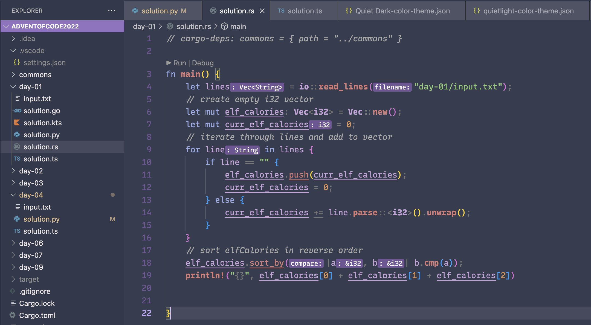

# Quieter Dark

Dark version of VS Code's default `Quiet Dark` theme.

## Sample 

## Source Code 

<https://github.com/championswimmer/vscode-theme-quieter-dark>

## Attribution

If you like this theme, please consider

 - giving it a star on [GitHub](https://github.com/championswimmer/vscode-theme-quieter-dark)
 - following me on [Twitter](https://twitter.com/championswimmer) or giving a shoutout
 - sending a donation on [Patreon](https://www.patreon.com/championswimmer)

## License

This theme is released under the MIT License. See [LICENSE.md](./LICENSE.md) for more details.